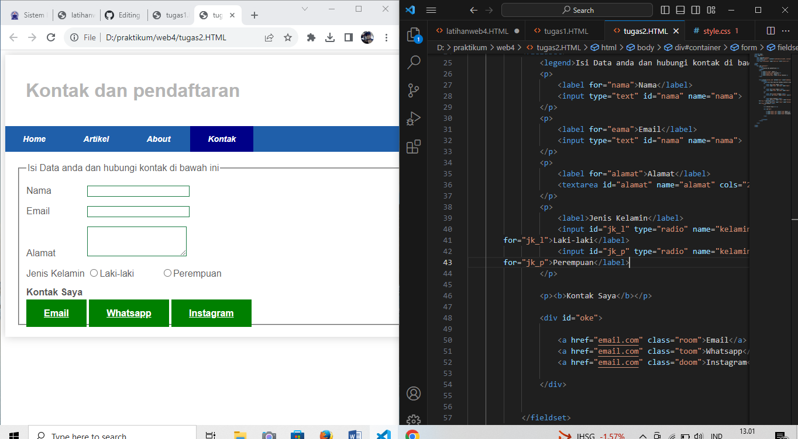

# lab4web

```
nama : m ryamizard r s
TI22A2
```
## Daftar isi

```
1. Tugas dan pertanyaan
2. praktek praktikum 4
```

## 1. Tugas dan pertanyaan

### 1. Tambahkan Layout untuk menu About
=> buat single layout yang berisi deskripsi, portfolio, dll


### 2. Tambahkan layout untuk menu Contact
=> yang berisi form isian: nama, email, message, dll




## 2. latihan praktikum

1. Buat kerangka layout


2. Buat navigasi


3. Membuat hero panel


4. Mengatur layout main sidebar


5. Membuat sidebar widget


6. Mengatur footer


7. menambahkan elemen lainnya pada content


8. Menambahkan konten artikel


### terimakasih 

